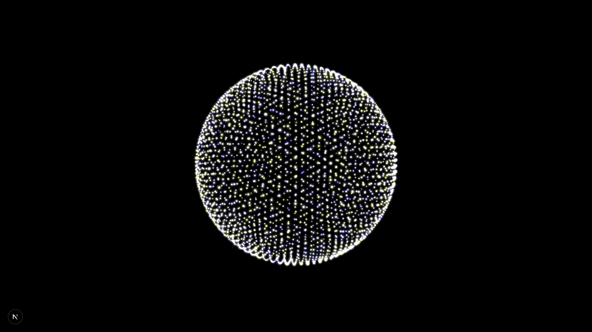
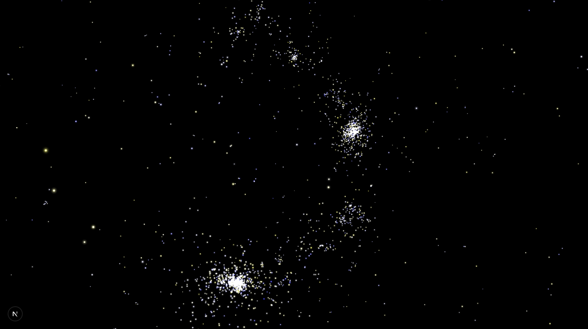

<h2>About the project</h2>

This is a N-Body gravitation simulation project based on 
Newton's law of universal gravitation

<h2>Framework used</h2>
Next.js and three.js

<h2>Project setup</h2>

```
const geo = new THREE.IcosahedronGeometry(3,15);
```

Used the vertex data to generate particle for the simulation, it will generate 
15360 particles in total
<h2>Main idea</h2>

Newton's law of universal gravitation describes gravity as a force by 
stating that every particle attracts every other particle in the universe 
with a force that is proportional to the product of their masses and 
inversely proportional to the square of the distance between their centers 
of mass.

To find gravitational force applied on each particle $j$ at any moment, 
use the equation for universal gravitation.

$$
\vec{F}=\sum_{i=0}^{n} G\frac{m_im_j}{r^2}
\frac{\left(\vec{p_i}-\vec{p_j}\right)}{\|\left(\vec{p_i}-\vec{p_j}\right)\|}
$$

We can then use it to compute a dynamic changing acceleration field

$$
\vec{a} = \frac{\vec{F}}{m}
$$

With that we can get the current velocity and 
position in using info from last frame

$$
\vec{v_{c}} = \vec{v_{c-1}} + \Delta{t}\vec{a}
$$

$$
\vec{p_{c}} = \vec{p_{c-1}} + \Delta{t}\vec{v}
$$

<h2>Issue</h2>

The step to compute gravitational field takes $O(n^2)$ 
comparison for $n$ particles, that is $15360^2$ computation 
per frame and for a 60fps device that will be $14155776000$
, 14 billion times computation per second.

It is quite difficult for CPU to handle task like this so
we are going to use GPGPU(general purpose GPU) method that 
use GPU for both computation and rendering.

<h2>GPGPU</h2>

I used two textures for data texture, one for storing and updating 
position, I use all 4 channel rgba for xyz position and mass, and one for 
storing and update for the velocity which I just use three channel
for velocity vector, and the acceleration field is computed when 
updating velocity data texture. The computation still takes $O(n^2)$
operation but we are using GPU to do the computation which contains
thousands of parallel processing units and can perform same operation on different particles.

<h2>Limitation</h2>

Since we are using particle-generated gravitational field to approximate the process,
we are going to lose or increase some amount of energy in every
step. So the energy is not conservative in this simulation.
The amount of energy lose or gained per frame depends on
$\Delta{t}$. Smaller $\Delta{t}$ per frame will result in more
accurate simulation. 


<figure>
  
  <figcaption>
    Figure 1. error in approximation
  </figcaption>
</figure>

Gravitational constant $G$ is also scaled for
purpose of demonstration. There is also some damping factor for numerical
stability, you can look into ```app/Simulation/Physics/GPGPU``` folder for more
detail.

<h2>Results</h2>

- ~15k particles simulated in real time
- Stable FPS on my MacBook air
- Interactive camera control

<figure>
  
  <figcaption>
    Figure 2. At beginning of the simulation
  </figcaption>
</figure>

<figure>
  
  <figcaption>
    Figure 3. Particle cluster generated in the simulation
  </figcaption>
</figure>

