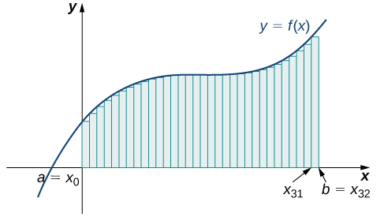
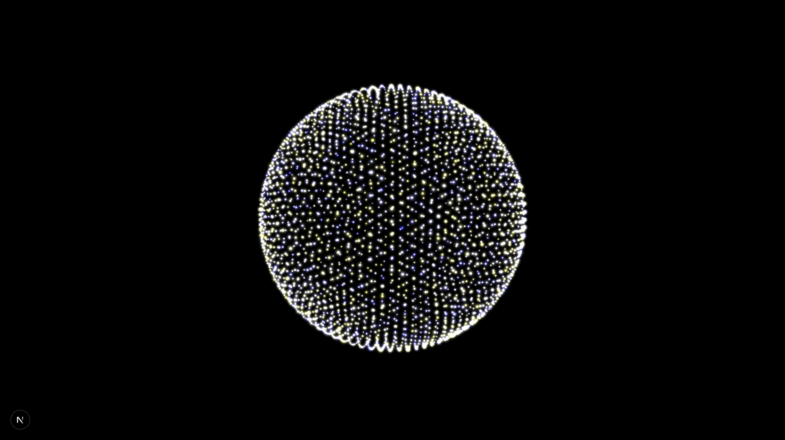
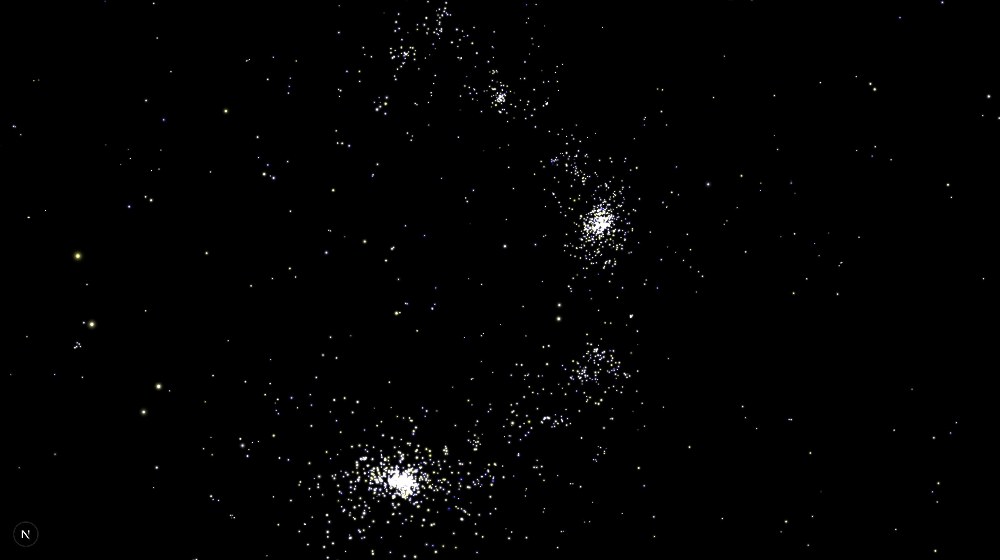

# N-Body Gravitation Simulation (GPGPU)

Real-time gravitational N-body simulation implemented with Three.js and GPGPU.

## Tech Stack

- Next.js
- Three.js
- GLSL
- GPUComputationRenderer

<h2>Project setup</h2>

```
const geo = new THREE.IcosahedronGeometry(3,15);
```

Used the vertex data to generate particle for the simulation, it will generate 
15360 particles in total

## Main idea

Newton's law of universal gravitation describes gravity as a force by 
stating that every particle attracts every other particle in the universe 
with a force that is proportional to the product of their masses and 
inversely proportional to the square of the distance between their centers 
of mass.

To find gravitational force applied on each particle $j$ at any moment, 
use the equation for universal gravitation.

$$
\vec{F}=\sum_{i=0}^{n} G\frac{m_im_j}{r^2}
\frac{\left(\vec{p_i}-\vec{p_j}\right)}{\|\left(\vec{p_i}-\vec{p_j}\right)\|}
$$

We can then use it to compute a dynamic changing acceleration field

$$
\vec{a} = \frac{\vec{F}}{m}
$$

With that we can get the current velocity and 
position in using info from last frame

$$
\vec{v_{c}} = \vec{v_{c-1}} + \Delta{t}\vec{a}
$$

$$
\vec{p_{c}} = \vec{p_{c-1}} + \Delta{t}\vec{v}
$$

<h2>Issue</h2>

The step to compute gravitational field takes $O(n^2)$.
For $15360$ particles this results in:

$15360^2$ ≈ 236M pairwise interactions per frame.

At 60 FPS this corresponds to roughly **14 billion interaction
computations per second**, which is impractical for a CPU implementation.

## GPGPU Approach

The simulation uses **GPU-based computation** to evaluate the
gravitational interactions.

Two floating-point textures are used:

• **Position texture**
- RGB: particle position
- A: particle mass

• **Velocity texture**
- RGB: particle velocity

Each fragment shader invocation updates one particle.

The shader iterates over the position texture to accumulate the
gravitational acceleration from all other particles.

Although the algorithm remains **O(n²)**, the GPU executes thousands
of fragments in parallel, making real-time simulation feasible.

<h2>Limitation</h2>

This simulation uses **Euler integration**, which does not conserve
energy perfectly.
The amount of energy lose or gained per frame depends on
$\Delta{t}$. Smaller $\Delta{t}$ per frame will result in more
accurate simulation. 


<figure>
  
  <figcaption>
    Figure 1. error in approximation
  </figcaption>
</figure>

Gravitational constant $G$ is also scaled for
purpose of demonstration. There is also some damping factor for numerical
stability, you can look into ```app/Simulation/Physics/GPGPU``` folder for more
detail.

<h2>Results</h2>

- ~15k particles simulated in real time
- Stable FPS on my MacBook air
- Interactive camera control
- ~236M particle interactions per frame

<figure>
  
  <figcaption>
    Figure 2. At beginning of the simulation
  </figcaption>
</figure>

<figure>
  
  <figcaption>
    Figure 3. Particle cluster generated in the simulation
  </figcaption>
</figure>

<h2>Deployment</h2>

- https://gravity-simulation-rose.vercel.app/
- You can also run locally by download repo and run command
```npm run dev```

